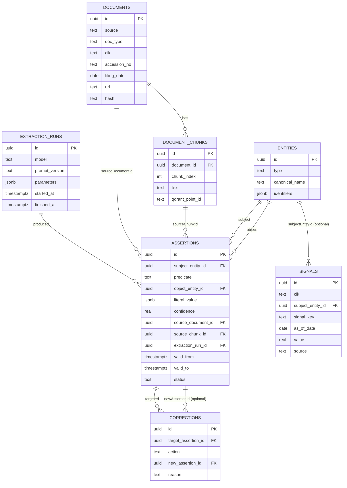
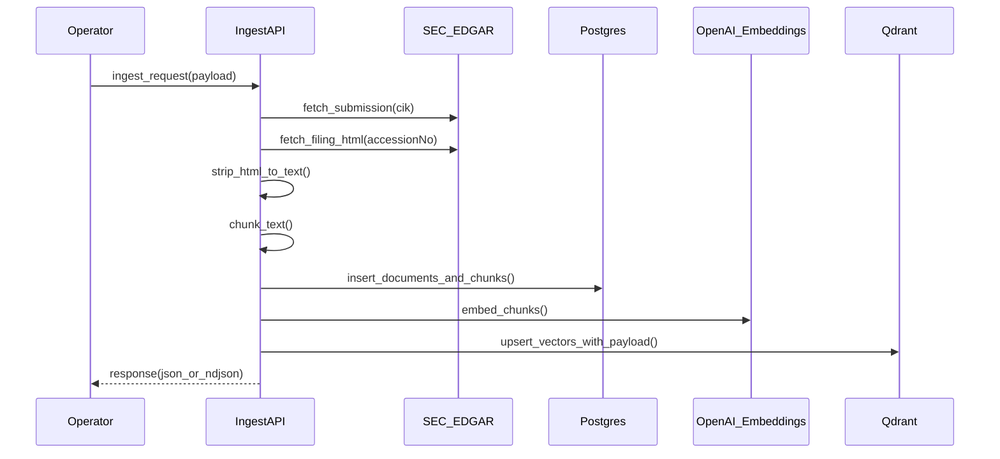
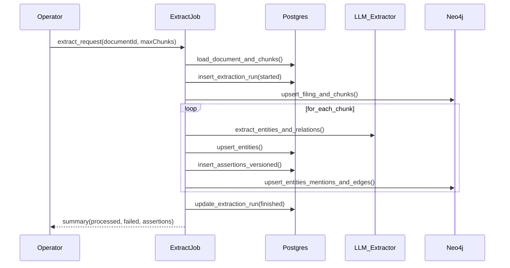
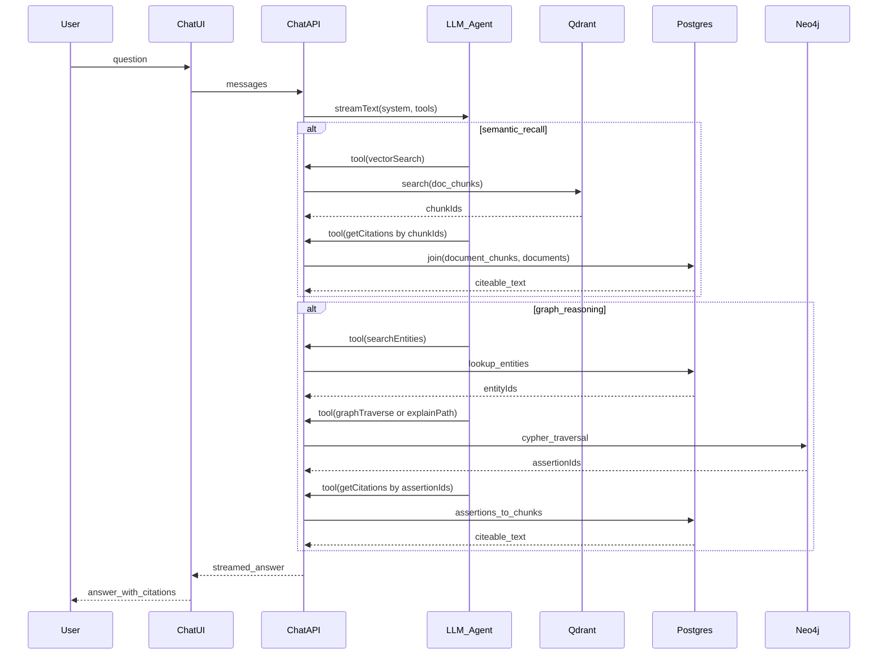
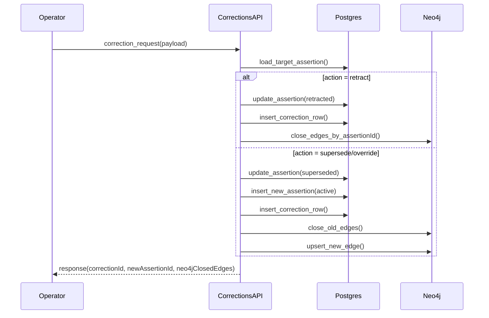

# Architecture Overview (Markets Knowledge Graph)

This document explains **how the whole system works end-to-end** — from ingestion to hybrid retrieval — and shows the architecture with **visual diagrams**.

> Mermaid diagrams render on GitHub and in many markdown viewers. If you view this somewhere that doesn’t render Mermaid, copy the code blocks into a Mermaid-enabled viewer.

---

## Why this architecture (the “3-store” pattern)

We use three specialized stores, each doing what it’s best at:

- **Postgres (Neon) = “Truth + provenance”**
  - Canonical rows for entities, filings, chunks, assertions (facts), versioning, corrections, and structured signals.
  - Enables auditability and deterministic queries.
- **Qdrant = “Semantic recall”**
  - Vector search over filing chunks (fast top‑K retrieval).
  - Returns **chunk IDs**, which we then resolve to text + metadata via Postgres citations.
- **Neo4j = “Reasoning / traversal”**
  - Traversable entity graph with relationship edges carrying `assertionId`, provenance, and versioning fields.
  - Enables explainable paths (“how is A connected to B?”).

The Next.js app (Vercel AI SDK) orchestrates all three via tool calls.

---

## Architecture (one-page overview)

```mermaid
flowchart LR
  subgraph client [Client]
    ChatUI["Chat UI (/)"]
    IngestionUI["Ingestion UI (/ingestion)"]
  end

  subgraph app [Next.js App (Node runtime)]
    ChatTools["Chat + tool router (AI SDK)"]
    Pipelines["Ingest + extract pipelines"]
  end

  subgraph stores [Data stores]
    Postgres["Postgres (Neon): truth + provenance"]
    Qdrant["Qdrant: semantic recall"]
    Neo4j["Neo4j: graph traversal"]
  end

  subgraph external [External]
    SecEdgar["SEC EDGAR"]
    OpenAI["OpenAI: embeddings + extraction"]
    Massive["Massive/Benzinga (optional signals)"]
  end

  ChatUI --> ChatTools
  IngestionUI --> Pipelines

  Pipelines -->|"fetch filings"| SecEdgar
  Pipelines -->|"write docs/chunks"| Postgres
  Pipelines -->|"embed chunks"| OpenAI
  Pipelines -->|"upsert vectors"| Qdrant
  Pipelines -->|"project graph"| Neo4j

  ChatTools -->|"vectorSearch"| Qdrant
  ChatTools -->|"graphTraverse/explainPath"| Neo4j
  ChatTools -->|"factsQuery/getCitations/listDocuments"| Postgres
  ChatTools -->|"LLM responses"| OpenAI

  Massive -. "optional ingest" .-> Postgres
```

**Code map (for the boxes above)**:
- **Chat + tool router**: `src/app/api/chat/route.ts`, `src/lib/ai/tools.ts`, `src/lib/retrieval/*`
- **Ingest pipeline**: `src/lib/edgar/ingest.ts`, `src/app/api/ingest/edgar/bulk/route.ts`
- **Extract + project pipeline**: `src/lib/extraction/run.ts`, `src/lib/neo4j/project.ts`
- **Stores**: `src/lib/db/*`, `src/lib/qdrant/*`, `src/lib/neo4j/*`
- **SEC fetch**: `src/lib/edgar/fetch.ts`

---

## Architecture (end-to-end dataflow)

```mermaid
flowchart TB
  SecEdgar["SEC EDGAR"]
  OpenAI["OpenAI"]
  Postgres[(Postgres)]
  Qdrant[(Qdrant)]
  Neo4j[(Neo4j)]

  subgraph ingest [Ingestion + indexing]
    FetchFiling["Fetch filing HTML"]
    HtmlToText["Strip HTML to text"]
    ChunkText["Chunk text"]
    WriteDocs["Write documents + chunks"]
    EmbedChunks["Embed chunks"]
    UpsertVectors["Upsert vectors + payload"]
  end

  subgraph extract [Extraction + projection]
    ReadChunks["Read chunks"]
    CreateRun["Create extraction run"]
    LlmExtract["Extract entities + relations"]
    UpsertEntities["Upsert entities"]
    InsertAssertions["Insert assertions (versioned)"]
    ProjectNeo4j["Project nodes + edges"]
  end

  subgraph serve [Serving (chat + tools)]
    UserQ["User question"]
    ChatApi["/api/chat"]
    ToolRouter["Tool router"]
    VectorSearch["vectorSearch"]
    GraphSearch["graphTraverse/explainPath"]
    FactsSearch["factsQuery/listDocuments"]
    GetCitations["getCitations"]
    Answer["Answer with citations"]
  end

  %% Ingestion
  SecEdgar -->|"submissions + filings"| FetchFiling --> HtmlToText --> ChunkText --> WriteDocs --> Postgres
  ChunkText --> EmbedChunks --> OpenAI
  EmbedChunks --> UpsertVectors --> Qdrant

  %% Extraction
  Postgres -->|"documentId + chunk text"| ReadChunks --> CreateRun --> Postgres
  ReadChunks --> LlmExtract --> OpenAI
  LlmExtract --> UpsertEntities --> Postgres
  LlmExtract --> InsertAssertions --> Postgres
  UpsertEntities --> ProjectNeo4j --> Neo4j
  InsertAssertions --> ProjectNeo4j

  %% Serving
  UserQ --> ChatApi --> ToolRouter
  ToolRouter --> VectorSearch --> Qdrant -->|"chunkIds"| GetCitations
  ToolRouter --> GraphSearch --> Neo4j -->|"assertionIds"| GetCitations
  ToolRouter --> FactsSearch --> Postgres
  GetCitations --> Postgres --> Answer
  ChatApi --> OpenAI
  Answer --> ChatApi
```

**How IDs connect the stores**:
- **Qdrant → Postgres**: `vectorSearch` returns `chunkIds` (stored as `document_chunks.id`), then `getCitations` joins `document_chunks` + `documents` for citeable text.
- **Neo4j → Postgres**: graph edges carry `assertionId`, then `getCitations(assertionIds)` resolves back to `assertions.sourceChunkId` → citeable text.

**Code map (end-to-end)**:
- **FetchFiling + HtmlToText**: `src/lib/edgar/fetch.ts`, `src/lib/text/normalize.ts`
- **ChunkText**: `src/lib/text/chunk.ts`
- **WriteDocs (documents + chunks)**: `src/lib/edgar/ingest.ts`, `src/lib/db/schema.ts`
- **EmbedChunks**: `src/lib/embeddings/openai.ts`
- **UpsertVectors**: `src/lib/edgar/ingest.ts`, `src/lib/qdrant/collections.ts`
- **ReadChunks + CreateRun + InsertAssertions**: `src/lib/extraction/run.ts`, `src/lib/db/schema.ts`
- **LlmExtract**: `src/lib/extraction/extract.ts`, `src/lib/extraction/schema.ts`
- **ProjectNeo4j**: `src/lib/neo4j/project.ts`
- **ToolRouter + tools**: `src/lib/ai/tools.ts`, `src/lib/retrieval/*`
- **ChatApi**: `src/app/api/chat/route.ts`

---

## Core data model (Postgres “truth layer”)

The relational schema lives in `src/lib/db/schema.ts`. The important thing is not just the tables, but the **provenance/versioning links** that make answers auditable.



**Key idea**: Qdrant is not the source of truth for text. Qdrant returns IDs; Postgres holds the **actual chunk text** and document metadata so we can cite evidence reliably.

---

## Qdrant (semantic recall layer)

Collection: `doc_chunks` (see `src/lib/qdrant/collections.ts`)

- Each point corresponds to a **document chunk**
- Payload includes (at least):
  - `chunk_id`, `document_id`, `cik`, `accession_no`, `doc_type`, `filing_date`, `chunk_index`
- Payload indexes are created for filterable fields (important for Qdrant Cloud).

Vector search is implemented in `src/lib/retrieval/vector.ts` as `vectorSearchChunks()`:

- Embeds the query using OpenAI embeddings (`embedTexts`)
- Runs Qdrant `search()`
- If the caller over-filters to zero hits, it **progressively broadens filters** (drop accession → drop docType → global fallback)

---

## Neo4j (graph reasoning layer)

Projection code: `src/lib/neo4j/project.ts`

### Nodes
- `(:Entity)` with a stable `entityId` + typed labels like `:Company`, `:Concept`, etc.
- `(:Filing)` keyed by `documentId`
- `(:Chunk)` keyed by `chunkId`

### Edges
- `(:Filing)-[:HAS_CHUNK]->(:Chunk)`
- `(:Chunk)-[:MENTIONS]->(:Entity)` (mentions are chunk-level grounding)
- Typed assertion edges between entities:
  - `(:Entity)-[:BENEFITS_FROM|EXPOSED_TO|SUPPLIES_TO|IMPACTS]->(:Entity)`
  - Each edge stores `assertionId`, provenance (`sourceDocumentId`, `sourceChunkId`), and versioning (`validFrom`, `validTo`, `status`)

Graph traversal lives in `src/lib/retrieval/graph.ts`:
- `graphTraverse(seedEntityIds, depth, edgeTypes, limit)`
- `explainPath(fromEntityId, toEntityId, edgeTypes, maxHops)`

---

## Ingestion: EDGAR → Postgres + Qdrant

The core ingestion function is `ingestEdgarLatest()` in `src/lib/edgar/ingest.ts`.

### What ingestion writes
- **Postgres**
  - `documents`: filing metadata (`cik`, `accessionNo`, `docType`, `filingDate`, `url`, `hash`)
  - `document_chunks`: chunked text (the citeable text)
  - `entities` (company stub): ensures `searchEntities()` works even before extraction
- **Qdrant**
  - Upserts vectors for each chunk (payload includes the fields used for filtering)

### Ingestion flow diagram



---

## Extraction: Postgres chunks → Assertions (Postgres) + Projection (Neo4j)

Extraction is run per document with `extractAndProjectDocument()` in `src/lib/extraction/run.ts`.

### What extraction does per chunk
- Calls the LLM to extract:
  - entities (type/name/aliases/identifiers)
  - relations (subject/predicate/object/confidence)
- Upserts entities into Postgres (dedupe on `(type, canonicalName)` today)
- Inserts versioned assertions into Postgres (`assertions`)
- Projects into Neo4j:
  - entity nodes
  - `MENTIONS` edges from chunk → entity
  - typed predicate edges from entity → entity with `assertionId`

### Extraction + projection flow diagram



---

## Chat: hybrid retrieval (Qdrant + Postgres + Neo4j)

The chat endpoint is `src/app/api/chat/route.ts`. It streams responses via the Vercel AI SDK and exposes tools defined in `src/lib/ai/tools.ts`.

### Tool surface (what the LLM can call)
- **Recall**
  - `vectorSearch` → Qdrant (returns chunk IDs)
  - `timelineSearch` → Postgres enumerate filings + per‑filing Qdrant search (over time)
- **Grounding**
  - `getCitations` → Postgres join to return chunk text + filing metadata
  - `listDocuments` → Postgres enumerate filings (discover accession/docType)
- **Graph reasoning**
  - `searchEntities` → Postgres (get entity IDs)
  - `graphTraverse` / `explainPath` → Neo4j traversal and paths
- **Truth/facts**
  - `factsQuery` → Postgres versioned assertions
- **Change management**
  - `GET /api/conflicts` → detects conflicts for single-valued predicates
  - `POST /api/corrections` → retract/supersede and updates Neo4j projection
- **Signals**
  - `screenSignals` → Postgres signals table for EPS/flows screens

### Chat execution flow diagram



---

## Corrections: versioning + projection updates

Corrections are applied via `POST /api/corrections` and implemented in `src/lib/corrections/apply.ts`.

Two key rules:
1) **Never overwrite history**: we mark old assertions inactive (`retracted`/`superseded`) and set `validTo`.
2) **Keep Neo4j in sync**: close old edges and (if needed) upsert the new edge.



---

## Conflicts: detection (baseline)

`GET /api/conflicts` runs `detectConflicts()` (`src/lib/conflicts/detect.ts`):

- For a small list of **single-valued predicates** (e.g. `CEO`)
- Finds subjects that have multiple distinct object values among active assertions
- Returns conflict groups so you can retract/supersede as needed

---

## Structured signals: EPS estimates + fund inflows

Signals live in Postgres (`signals` table). They are optional but important for queries that filings alone won’t answer well.

- Ingest via `POST /api/ingest/signals` (protected by `x-ingestion-secret`)
- Query via the `screenSignals` tool (`src/lib/signals/screen.ts`)

The design choice here is deliberate:
- Signals are **time series**, so they are modeled separately from text assertions.
- Signals keep provenance fields (`source`, `sourceRef`, `raw`) so they remain auditable.

---

## Deployment notes (Vercel)

- API routes run in the **Node runtime** (server-side) and talk to Neon/Qdrant/Neo4j.
- Some pages (like `/ingestion`) must not be statically prerendered during build if they require DB access.

---

## Where to look in code (map)

- **Chat orchestration**: `src/app/api/chat/route.ts`
- **Tool definitions**: `src/lib/ai/tools.ts`
- **EDGAR ingestion**: `src/lib/edgar/ingest.ts`
- **Extraction + Neo4j projection**: `src/lib/extraction/run.ts`, `src/lib/neo4j/project.ts`
- **Retrieval functions**: `src/lib/retrieval/*`
- **Corrections**: `src/lib/corrections/apply.ts`, `src/app/api/corrections/route.ts`
- **Conflicts**: `src/lib/conflicts/detect.ts`, `src/app/api/conflicts/route.ts`
- **Signals**: `src/lib/signals/*`, `src/app/api/ingest/signals/route.ts`


