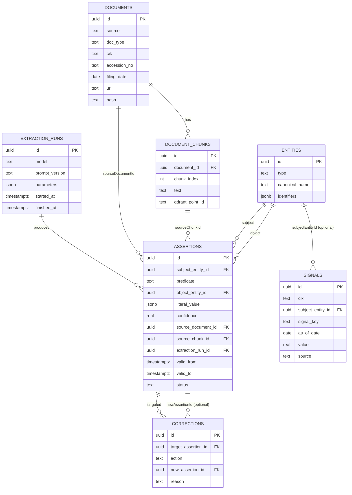
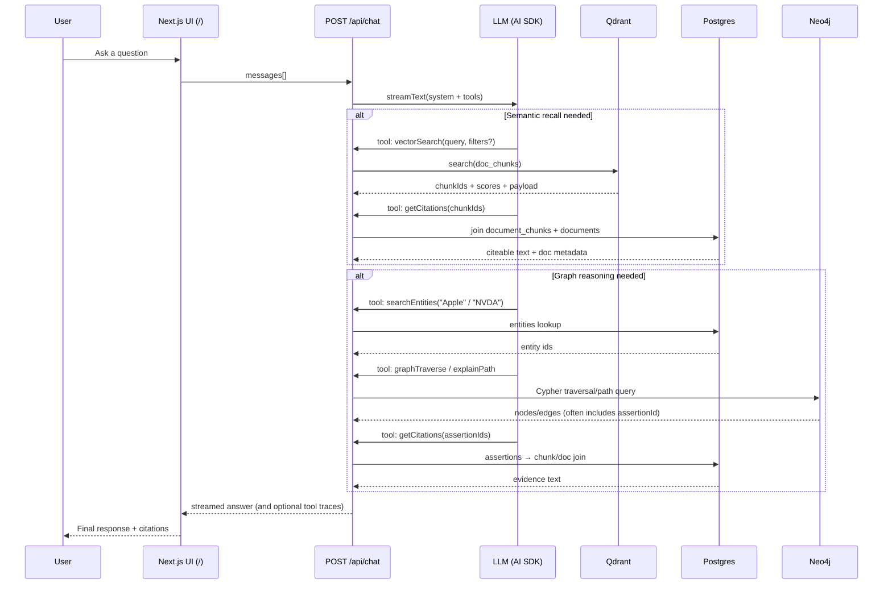
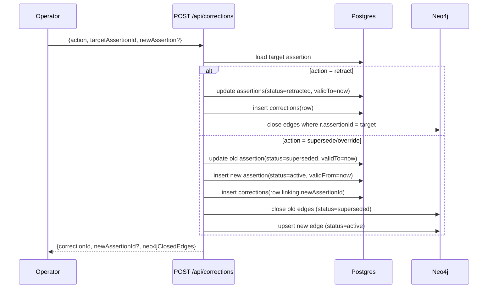

# Architecture Overview (Markets Knowledge Graph)

This document explains **how the whole system works end-to-end** — from ingestion to hybrid retrieval — and shows the architecture with **visual diagrams**.

> Mermaid diagrams render on GitHub and in many markdown viewers. If you view this somewhere that doesn’t render Mermaid, copy the code blocks into a Mermaid-enabled viewer.

---

## Why this architecture (the “3-store” pattern)

We use three specialized stores, each doing what it’s best at:

- **Postgres (Neon) = “Truth + provenance”**
  - Canonical rows for entities, filings, chunks, assertions (facts), versioning, corrections, and structured signals.
  - Enables auditability and deterministic queries.
- **Qdrant = “Semantic recall”**
  - Vector search over filing chunks (fast top‑K retrieval).
  - Returns **chunk IDs**, which we then resolve to text + metadata via Postgres citations.
- **Neo4j = “Reasoning / traversal”**
  - Traversable entity graph with relationship edges carrying `assertionId`, provenance, and versioning fields.
  - Enables explainable paths (“how is A connected to B?”).

The Next.js app (Vercel AI SDK) orchestrates all three via tool calls.

---

## System diagram (high-level)

```mermaid
flowchart LR
  subgraph Client
    B[Browser\nChat UI (/) + Ingestion UI (/ingestion)]
  end

  subgraph App["Next.js (Node runtime)"]
    ChatAPI["POST /api/chat\nVercel AI SDK streamText + tools"]
    IngestOne["POST /api/ingest/edgar\n(single CIK)"]
    IngestBulk["POST /api/ingest/edgar/bulk\n(concurrency + NDJSON progress)"]
    SignalsAPI["POST /api/ingest/signals\n(time series signals)"]
    CorrectionsAPI["POST /api/corrections\n(retract/supersede/override)"]
    ConflictsAPI["GET /api/conflicts\n(conflict detection)"]
  end

  subgraph Stores
    PG[(Postgres/Neon)]
    QD[(Qdrant\ncollection: doc_chunks)]
    N4J[(Neo4j)]
  end

  subgraph External
    SEC[SEC EDGAR]
    OpenAI[OpenAI API\n(embeddings + extraction models)]
    Massive[Massive/Benzinga\n(optional signals source)]
  end

  B --> ChatAPI
  B --> IngestOne
  B --> IngestBulk

  IngestOne --> SEC
  IngestBulk --> SEC
  IngestOne --> PG
  IngestBulk --> PG
  IngestOne --> OpenAI
  IngestBulk --> OpenAI
  IngestOne --> QD
  IngestBulk --> QD

  ChatAPI --> OpenAI
  ChatAPI --> QD
  ChatAPI --> PG
  ChatAPI --> N4J

  SignalsAPI --> PG
  SignalsAPI -. optional .-> Massive

  CorrectionsAPI --> PG
  CorrectionsAPI --> N4J

  ConflictsAPI --> PG
```

---

## Core data model (Postgres “truth layer”)

The relational schema lives in `src/lib/db/schema.ts`. The important thing is not just the tables, but the **provenance/versioning links** that make answers auditable.



**Key idea**: Qdrant is not the source of truth for text. Qdrant returns IDs; Postgres holds the **actual chunk text** and document metadata so we can cite evidence reliably.

---

## Qdrant (semantic recall layer)

Collection: `doc_chunks` (see `src/lib/qdrant/collections.ts`)

- Each point corresponds to a **document chunk**
- Payload includes (at least):
  - `chunk_id`, `document_id`, `cik`, `accession_no`, `doc_type`, `filing_date`, `chunk_index`
- Payload indexes are created for filterable fields (important for Qdrant Cloud).

Vector search is implemented in `src/lib/retrieval/vector.ts` as `vectorSearchChunks()`:

- Embeds the query using OpenAI embeddings (`embedTexts`)
- Runs Qdrant `search()`
- If the caller over-filters to zero hits, it **progressively broadens filters** (drop accession → drop docType → global fallback)

---

## Neo4j (graph reasoning layer)

Projection code: `src/lib/neo4j/project.ts`

### Nodes
- `(:Entity)` with a stable `entityId` + typed labels like `:Company`, `:Concept`, etc.
- `(:Filing)` keyed by `documentId`
- `(:Chunk)` keyed by `chunkId`

### Edges
- `(:Filing)-[:HAS_CHUNK]->(:Chunk)`
- `(:Chunk)-[:MENTIONS]->(:Entity)` (mentions are chunk-level grounding)
- Typed assertion edges between entities:
  - `(:Entity)-[:BENEFITS_FROM|EXPOSED_TO|SUPPLIES_TO|IMPACTS]->(:Entity)`
  - Each edge stores `assertionId`, provenance (`sourceDocumentId`, `sourceChunkId`), and versioning (`validFrom`, `validTo`, `status`)

Graph traversal lives in `src/lib/retrieval/graph.ts`:
- `graphTraverse(seedEntityIds, depth, edgeTypes, limit)`
- `explainPath(fromEntityId, toEntityId, edgeTypes, maxHops)`

---

## Ingestion: EDGAR → Postgres + Qdrant

The core ingestion function is `ingestEdgarLatest()` in `src/lib/edgar/ingest.ts`.

### What ingestion writes
- **Postgres**
  - `documents`: filing metadata (`cik`, `accessionNo`, `docType`, `filingDate`, `url`, `hash`)
  - `document_chunks`: chunked text (the citeable text)
  - `entities` (company stub): ensures `searchEntities()` works even before extraction
- **Qdrant**
  - Upserts vectors for each chunk (payload includes the fields used for filtering)

### Ingestion flow diagram

```mermaid
sequenceDiagram
  participant Op as Operator (UI / curl)
  participant API as POST /api/ingest/edgar(/bulk)
  participant SEC as SEC EDGAR
  participant PG as Postgres
  participant E as OpenAI Embeddings
  participant Q as Qdrant (doc_chunks)

  Op->>API: {cik(s), forms, maxFilings, maxChunksPerFiling, ...}
  API->>SEC: fetch submission metadata
  API->>SEC: fetch filing HTML
  API->>API: strip HTML → text; chunk text
  API->>PG: insert documents + document_chunks
  API->>E: embed chunk texts
  API->>Q: upsert vectors + payload (chunk_id, document_id, cik, ...)
  API-->>Op: JSON or NDJSON progress events
```

---

## Extraction: Postgres chunks → Assertions (Postgres) + Projection (Neo4j)

Extraction is run per document with `extractAndProjectDocument()` in `src/lib/extraction/run.ts`.

### What extraction does per chunk
- Calls the LLM to extract:
  - entities (type/name/aliases/identifiers)
  - relations (subject/predicate/object/confidence)
- Upserts entities into Postgres (dedupe on `(type, canonicalName)` today)
- Inserts versioned assertions into Postgres (`assertions`)
- Projects into Neo4j:
  - entity nodes
  - `MENTIONS` edges from chunk → entity
  - typed predicate edges from entity → entity with `assertionId`

### Extraction + projection flow diagram

```mermaid
sequenceDiagram
  participant Op as Operator (UI / curl)
  participant X as extractAndProjectDocument
  participant PG as Postgres
  participant LLM as LLM (structured extraction)
  participant N as Neo4j

  Op->>X: {documentId, maxChunks?}
  X->>PG: read document + chunks
  X->>PG: insert extraction_runs(started)
  X->>N: ensure constraints; upsert Filing + Chunk nodes

  loop for each chunk
    X->>LLM: extract entities + relations
    X->>PG: upsert entities
    X->>PG: insert assertions (versioned, with provenance)
    X->>N: upsert Entity nodes
    X->>N: upsert (Chunk)-[:MENTIONS]->(Entity)
    X->>N: upsert typed assertion edges (assertionId, validFrom/To, status)
  end

  X->>PG: update extraction_runs(finished)
  X-->>Op: summary (processed/failed chunks, inserted assertions, etc.)
```

---

## Chat: hybrid retrieval (Qdrant + Postgres + Neo4j)

The chat endpoint is `src/app/api/chat/route.ts`. It streams responses via the Vercel AI SDK and exposes tools defined in `src/lib/ai/tools.ts`.

### Tool surface (what the LLM can call)
- **Recall**
  - `vectorSearch` → Qdrant (returns chunk IDs)
  - `timelineSearch` → Postgres enumerate filings + per‑filing Qdrant search (over time)
- **Grounding**
  - `getCitations` → Postgres join to return chunk text + filing metadata
  - `listDocuments` → Postgres enumerate filings (discover accession/docType)
- **Graph reasoning**
  - `searchEntities` → Postgres (get entity IDs)
  - `graphTraverse` / `explainPath` → Neo4j traversal and paths
- **Truth/facts**
  - `factsQuery` → Postgres versioned assertions
- **Change management**
  - `GET /api/conflicts` → detects conflicts for single-valued predicates
  - `POST /api/corrections` → retract/supersede and updates Neo4j projection
- **Signals**
  - `screenSignals` → Postgres signals table for EPS/flows screens

### Chat execution flow diagram



---

## Corrections: versioning + projection updates

Corrections are applied via `POST /api/corrections` and implemented in `src/lib/corrections/apply.ts`.

Two key rules:
1) **Never overwrite history**: we mark old assertions inactive (`retracted`/`superseded`) and set `validTo`.
2) **Keep Neo4j in sync**: close old edges and (if needed) upsert the new edge.



---

## Conflicts: detection (baseline)

`GET /api/conflicts` runs `detectConflicts()` (`src/lib/conflicts/detect.ts`):

- For a small list of **single-valued predicates** (e.g. `CEO`)
- Finds subjects that have multiple distinct object values among active assertions
- Returns conflict groups so you can retract/supersede as needed

---

## Structured signals: EPS estimates + fund inflows

Signals live in Postgres (`signals` table). They are optional but important for queries that filings alone won’t answer well.

- Ingest via `POST /api/ingest/signals` (protected by `x-ingestion-secret`)
- Query via the `screenSignals` tool (`src/lib/signals/screen.ts`)

The design choice here is deliberate:
- Signals are **time series**, so they are modeled separately from text assertions.
- Signals keep provenance fields (`source`, `sourceRef`, `raw`) so they remain auditable.

---

## Deployment notes (Vercel)

- API routes run in the **Node runtime** (server-side) and talk to Neon/Qdrant/Neo4j.
- Some pages (like `/ingestion`) must not be statically prerendered during build if they require DB access.

---

## Where to look in code (map)

- **Chat orchestration**: `src/app/api/chat/route.ts`
- **Tool definitions**: `src/lib/ai/tools.ts`
- **EDGAR ingestion**: `src/lib/edgar/ingest.ts`
- **Extraction + Neo4j projection**: `src/lib/extraction/run.ts`, `src/lib/neo4j/project.ts`
- **Retrieval functions**: `src/lib/retrieval/*`
- **Corrections**: `src/lib/corrections/apply.ts`, `src/app/api/corrections/route.ts`
- **Conflicts**: `src/lib/conflicts/detect.ts`, `src/app/api/conflicts/route.ts`
- **Signals**: `src/lib/signals/*`, `src/app/api/ingest/signals/route.ts`


